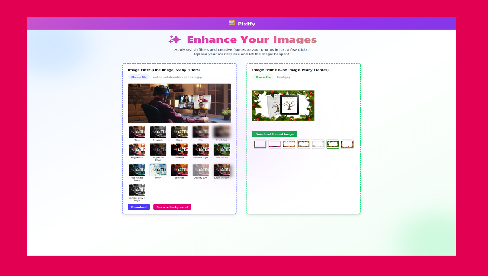

# 🎨 React Image Editor

A modern and interactive image editor built with **React**, allowing users to:

- 📤 Upload an image
- 🎛️ Apply filters (e.g., brightness, contrast, grayscale)
- 🖼️ Add decorative frames
- 🪄 Remove image backgrounds using the [Remove.bg API](https://www.remove.bg/)

This project is perfect for quick custom edits, profile pictures, creative projects, or social media posts — all in the browser.

## Table of contents

- [Overview](#overview)
  - [Screenshot](#screenshot)
  - [Links](#links)
- [My process](#my-process)
  - [Built with](#built-with)
  - [What I learned](#what-i-learned)

## Overview

This React-based image editor lets users upload a photo and enhance it in multiple ways. The app provides a smooth and user-friendly interface for applying visual filters, adding stylish overlays or frames, and removing image backgrounds via the remove.bg API.

Whether you're a casual user looking to create aesthetic edits or a developer exploring image manipulation in the browser, this tool is powerful yet lightweight.

### Screenshot

### Links

- Solution URL: [View Code](https://github.com/Ramelzkie96/pixify-image.git)
- Live Site URL: [Live Site](https://pixify-image.netlify.app/)

## My Process

This project was designed with usability and simplicity in mind. I focused on a component-driven structure using React hooks for state management and encapsulated logic. The goal was to build a smooth, responsive experience where users could easily modify images without needing external tools.

The background removal functionality was integrated using the remove.bg API, which required handling file uploads, API key validation, error handling, and rendering output dynamically.

Frames and filters are layered on top of the image using HTML5 Canvas, ensuring good performance and real-time updates.

### Built With

- ⚛️ [React](https://reactjs.org/) – JavaScript library for building user interfaces
- 🖼️ HTML5 Canvas – For rendering and combining images and frames
- 🎨 [Tailwind CSS](https://tailwindcss.com/) – Utility-first CSS framework for fast styling
- 📦 Vite – Lightning-fast build tool and development server
- 🌐 [Remove.bg API](https://www.remove.bg/api) – For AI-powered background removal
- 🍞 [React Hot Toast](https://react-hot-toast.com/) – For elegant toast notifications

### What I Learned

Through building this project, I gained deeper experience in several key areas of frontend development:

- 🧠 **React Hooks** – Leveraged `useState`, `useRef`, and `useEffect` to manage stateful logic and render updates efficiently.
- 🎨 **Canvas API** – Learned how to draw, layer, and manipulate images using HTML5 Canvas.
- 🧪 **Error Handling** – Implemented client-side validation and graceful error messaging for unsupported file types and expired API keys.
- 🔐 **API Integration** – Integrated an external service (remove.bg) and managed API keys securely through environment variables.
- 🖼️ **Dynamic Image Rendering** – Developed real-time image previews with filter effects, frame overlays, and background removal support.
- 🧰 **Tooling with Vite** – Improved workflow and performance using Vite for fast development builds.
- 💅 **Tailwind CSS** – Created a fully responsive, clean UI using utility classes with Tailwind.
